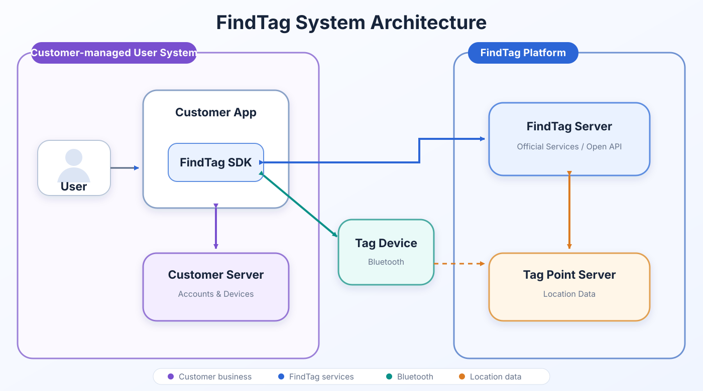

# FindTag iOS SDK

Supports both the FindTag user system and customer-managed user systems.

- `TagIntegrationModeOfficial`: FindTag manages user accounts, device relationships, and device lists.
- `TagIntegrationModeCustomerManaged`: Your app and backend manage users and device relationships.
- Bluetooth: Scan for and bind nearby FindTag devices over Bluetooth Low Energy (BLE).

This repository provides the FindTag iOS SDK, a demo application, and integration guides in Chinese and English.

## System Architecture



## SDK Version

- Current version: `V1_0828`
- SDK file: [sdk-findtag-release.xcframework](libs/sdk-findtag-release.xcframework)

## Swift Package Manager

Add the package URL and select version `1.0.0`:

```text
https://github.com/EvetSoftware/FindTag_iOS_SDK.git
```

The package product and imported module are both named `TagSdk`.

## CocoaPods

Reference the tagged pod directly from GitHub:

```ruby
pod 'FindTagSDK', :git => 'https://github.com/EvetSoftware/FindTag_iOS_SDK.git', :tag => '1.0.0'
```

## Integration Guides

- [English integration guide](docs/tag-sdk-ios-integration-guide-en.md)
- [中文接入指南](docs/tag-sdk-ios-integration-guide-zh.md)

## Repository Structure

```text
FindTag_iOS_SDK/
├── libs/       # FindTag SDK XCFramework
├── demo/       # iOS demo project
├── docs/       # Integration guides
├── LICENSE
└── README.md
```

## License

This project is licensed under the [MIT License](LICENSE).
