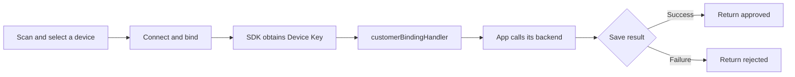

# FindTag iOS SDK Integration Guide

## 1. About This Guide

This guide explains how to integrate the FindTag iOS SDK, including XCFramework integration, Bluetooth permission configuration, and use of the public APIs.

The SDK supports two integration modes:

| Mode | Use Case | Account, Device Relationship, and Device List |
| --- | --- | --- |
| `TagIntegrationModeOfficial` | Uses the official Tag account system | Handled through the SDK |
| `TagIntegrationModeCustomerManaged` | Uses your own account system | Handled by your app and backend |

### 1.1 Requirements

- iOS 15.0 or later.
- The SDK supports both Objective-C and Swift projects. All examples in this guide use Objective-C.
- All asynchronous callbacks are delivered on the main thread and may update the UI directly.

## 2. Add the SDK

### 2.1 Integrate the XCFramework

Add the following file to your app project:

```text
sdk-findtag-release.xcframework
```

In Xcode, select your app target, open `General` → `Frameworks, Libraries, and Embedded Content`, add the XCFramework, and set `Embed` to `Embed & Sign`.

### 2.2 Import the Module

Add the following import to each Objective-C file that uses the SDK:

```objective-c
@import TagSdk;
```

The SDK does not depend on a third-party networking library, so your app does not need to initialize any additional networking components.

## 3. Bluetooth Permission

### 3.1 Info.plist Configuration

Add a Bluetooth usage description to your app's `Info.plist`. Adjust the text to match your product:

```xml
<key>NSBluetoothAlwaysUsageDescription</key>
<string>Used to discover, bind, and find your Tag devices</string>
```

You can also add `Privacy - Bluetooth Always Usage Description` on the target's `Info` page.

### 3.2 Authorization and Bluetooth State

iOS displays the system authorization prompt when the app first uses Bluetooth. Your app does not need to call a separate Bluetooth authorization API, but the usage description must be configured in advance.

If the user denies Bluetooth permission, the SDK returns `permissionDenied`. If Bluetooth is turned off or BLE is unavailable on the device, the SDK returns `bluetoothUnavailable`.

## 4. Initialization and Release

### 4.1 Initialization Configuration

Initialize the SDK once on the main thread, preferably in `AppDelegate` or at your business entry point:

```objective-c
TagSdkConfig *config = [[TagSdkConfig alloc]
    initWithIntegrationMode:TagIntegrationModeOfficial
    openApiCredential:nil
    customerBindingTimeoutMs:30000
    customerBindingHandler:nil
    logEnabled:YES];

TagError *initializationError = [TagSdk initializeWithConfig:config];
if (initializationError != nil) {
    [self showError:initializationError];
}
```

`TagSdkConfig` parameters:

| Parameter | Type | Required / Default | Applicable Mode | Description |
| --- | --- | --- | --- | --- |
| `integrationMode` | `TagIntegrationMode` | Required | All | 1. `TagIntegrationModeOfficial`: uses the official Tag account, device, and location APIs.<br>2. `TagIntegrationModeCustomerManaged`: uses your app's own account system.<br>The mode cannot be changed while the SDK is initialized. Call `releaseSdk` before initializing again with another mode. |
| `openApiCredential` | `TagOpenApiCredential *` | Optional; `nil` | Customer-managed | Open API credentials for location data queries, containing the provided `apiKey` and `apiSecret`. Configure this value when calling `getDeviceData`; otherwise, pass `nil`. It is not required in official mode. |
| `customerBindingTimeoutMs` | `int64_t` | Optional; `30000` | Customer-managed | Maximum time, in milliseconds, that the SDK waits for `CustomerBindingHandler` to return your backend's binding result. The value must be greater than `0`. A timeout returns `customerBindingTimeout`. |
| `customerBindingHandler` | `id<CustomerBindingHandler>` | Optional; `nil` | Customer-managed | Your implementation that handles device binding for your own account system. |
| `logEnabled` | `BOOL` | Optional; `YES` | All | Controls SDK diagnostic logging. Keep it enabled during integration and testing. It can also be changed at runtime through `setLogEnabled`. |

`initializeWithConfig:` returns `nil` on success or a `TagError` on failure.

### 4.2 SDK Version

```objective-c
NSString *version = [TagSdk getSdkVersion];
```

### 4.3 Release

Call the following method when the SDK is no longer needed:

```objective-c
[TagSdk releaseSdk];
```

## 5. Official Tag Account APIs

### 5.1 Account APIs

#### 5.1.1 Register

```objective-c
TagRegisterRequest *request = [[TagRegisterRequest alloc]
    initWithUsername:username
    password:password];

[TagSdk register:request completion:^(TagAccount *account, TagError *error) {
    if (error != nil) {
        [self showError:error];
        return;
    }

    // Registration does not log the user in automatically.
    [self openLoginPage];
}];
```

A successful registration does not create a local login session. Return the user to the login page and call `login:completion:` explicitly.

#### 5.1.2 Log In

```objective-c
TagLoginRequest *request = [[TagLoginRequest alloc]
    initWithUsername:username
    password:password];

[TagSdk login:request completion:^(TagAccount *account, TagError *error) {
    if (error != nil) {
        [self showError:error];
        return;
    }

    [self openHomePage];
}];
```

#### 5.1.3 Get the Current Account

```objective-c
TagAccount *account = [TagSdk getCurrentAccount];
```

`TagAccount` fields:

| Field | Description |
| --- | --- |
| `accountId` | Tag account identifier |
| `username` | Username |
| `nickname` | Optional nickname |
| `email` | Optional email address |

#### 5.1.4 Log Out

Call the following method when the user logs out:

```objective-c
[TagSdk logout];
```

If `authenticationFailed` is returned, direct the user to the login page to log in again.

### 5.2 Bluetooth State and Device Scanning

#### 5.2.1 Observe Bluetooth State

Implement `TagBluetoothStateListener` in your page:

```objective-c
@interface DeviceViewController () <TagBluetoothStateListener>
@property (nonatomic, strong) id<TagSubscription> bluetoothSubscription;
@end

@implementation DeviceViewController

- (void)startObservingBluetooth {
    self.bluetoothSubscription = [TagSdk observeBluetoothState:self];
}

- (void)onStateChanged:(TagBluetoothState)state {
    switch (state) {
        case TagBluetoothStatePoweredOn:
            break;
        case TagBluetoothStatePoweredOff:
            [self showBluetoothOff];
            break;
        case TagBluetoothStateUnauthorized:
            [self showBluetoothPermissionHelp];
            break;
        case TagBluetoothStateUnknown:
            break;
    }
}

- (void)stopObservingBluetooth {
    [self.bluetoothSubscription cancel];
    self.bluetoothSubscription = nil;
}

@end
```

The current state is delivered immediately after the subscription succeeds. Call `cancel` when the page no longer needs Bluetooth state updates.

#### 5.2.2 Start Scanning

Implement `TagScanListener` in your page:

```objective-c
@interface SearchViewController () <TagScanListener>
@property (nonatomic, strong) id<TagSubscription> scanSubscription;
@end

- (void)startScan {
    TagScanOptions *options = [[TagScanOptions alloc] initWithTimeoutMs:15000];
    self.scanSubscription = [TagSdk startScanWithOptions:options listener:self];
}

- (void)onDeviceFound:(TagDevice *)device {
    // The same device may be delivered again with an updated RSSI value.
    [self updateDevice:device];
}

- (void)onScanFinished:(TagScanFinishReason)reason {
    [self showScanFinished:reason];
}

- (void)onScanFailed:(TagError *)error {
    [self showError:error];
}
```

`TagDevice` fields:

| Field | Description |
| --- | --- |
| `id` | Identifier for the current scanned device; it can be used for list deduplication |
| `name` | Optional advertised name |
| `rssi` | Most recently received signal strength |
| `platformAddress` | Colon-separated advertised MAC address; it may be empty |
| `advertisedMac` | Optional device MAC address parsed from the advertisement |

Binding and Find Device operations must use the `TagDevice` returned by the current scan. Do not construct or persist it yourself.

Scan finish reasons:

| Enum | Description |
| --- | --- |
| `TagScanFinishReasonTimeout` | The scan timeout was reached |
| `TagScanFinishReasonStopped` | `stopScan` was called |
| `TagScanFinishReasonOperationStarted` | The SDK automatically stopped scanning because a binding or Find Device operation started |

Scan failures are delivered through `onScanFailed:`. Starting another scan while one is already running returns `scanAlreadyRunning`.

#### 5.2.3 Stop or Cancel Scanning

```objective-c
[TagSdk stopScan];
```

An explicit stop delivers `onScanFinished:TagScanFinishReasonStopped` to the current listener.

```objective-c
[self.scanSubscription cancel];
self.scanSubscription = nil;
```

When the page is destroyed, call `cancel` to stop the scan and prevent further callbacks.

### 5.3 Connect, Bind, and Find Device

Binding and Find Device operations run serially in invocation order. Disable repeated taps while an operation is running.

#### 5.3.1 Connect and Bind

Use a `TagDevice` returned by the current scan:

```objective-c
[TagSdk connectAndBindDevice:selectedDevice
    completion:^(TagBindingInfo *info, TagError *error) {
        if (error != nil) {
            [self showError:error];
            return;
        }

        NSString *deviceKey = info.primaryDeviceKey.deviceKey;
        [self showBindingSuccess:deviceKey];
    }];
```

The SDK completes device binding automatically. Determine the final result by checking whether `info != nil` or `error != nil`.

`TagBindingInfo` returns the primary Device Key from the current binding operation:

| Field | Description |
| --- | --- |
| `primaryDeviceKey` | Primary Device Key |

For `TagError` codes and suggested handling, see [Chapter 8: Error Handling](#8-error-handling).

#### 5.3.2 Find Device

```objective-c
[TagSdk findDevice:selectedDevice
    completion:^(FindDeviceResult *result, TagError *error) {
        if (error != nil) {
            [self showError:error];
            return;
        }

        if (result.triggered) {
            [self showFindDeviceSuccess];
        }
    }];
```

The SDK disconnects automatically after the operation completes. If `battery` is not empty, you may read the device battery level.

### 5.4 Device List, Updates, Unbinding, and Location Data

#### 5.4.1 Get the Device List

```objective-c
[TagSdk getDeviceList:^(NSArray<TagDeviceInfo *> *devices, TagError *error) {
    if (error != nil) {
        [self showError:error];
        return;
    }

    [self renderDeviceList:devices];
}];
```

Common `TagDeviceInfo` fields:

| Field | Description |
| --- | --- |
| `serverRecordId` | Device relationship record ID on the Tag server |
| `tagDeviceId` | Optional shorter device business identifier, set when returned by the backend |
| `deviceName` | Device name; initially the Bluetooth name and editable afterward |
| `macAddresses` | MAC addresses |
| `primaryDeviceKey` | Primary Device Key |
| `batteryLevel` | Optional server-side battery level |
| `deviceType` | Device type used to select a device icon; it can be updated |
| `deviceModelRawValue` | Optional raw device model value |
| `supportsElectronicFence` | Whether the device supports electronic fencing |
| `relationshipType` | Device relationship type: `1` for a device bound by the current user and `2` for a shared device |

After binding succeeds, call `getDeviceList:` to refresh the device list.

#### 5.4.2 Update Device Information

Use the primary Device Key from the device list to update the device name and type:

```objective-c
TagDeviceUpdateRequest *request = [[TagDeviceUpdateRequest alloc]
    initWithDeviceKey:device.primaryDeviceKey
    deviceName:@"My Tag"
    deviceType:@"1"];

[TagSdk updateDeviceInfo:request completion:^(NSNumber *success, TagError *error) {
    if (error != nil) {
        [self showError:error];
        return;
    }

    [self refreshDeviceList];
}];
```

`deviceName` and `deviceType` must not be empty. After a successful update, call `getDeviceList:` again to refresh the page.

#### 5.4.3 Unbind

Pass the `TagDeviceKey` returned by the device list directly:

```objective-c
[TagSdk unbindDevice:device.primaryDeviceKey
    completion:^(NSNumber *success, TagError *error) {
        if (error != nil) {
            [self showError:error];
            return;
        }

        [self removeDeviceFromUI:device];
    }];
```

The device does not need to be nearby when it is unbound.

#### 5.4.4 Query Location Data

Query the latest data:

```objective-c
TagDeviceDataQuery *query = [[TagDeviceDataQuery alloc]
    initWithDeviceKey:device.primaryDeviceKey
    preset:TagDeviceDataPresetLatest
    startTimeMs:nil
    endTimeMs:nil];

[TagSdk getDeviceData:query
    completion:^(NSArray<TagDeviceData *> *data, TagError *error) {
        if (error != nil) {
            [self showError:error];
            return;
        }

        TagDeviceData *latest = data.firstObject;
        [self renderLocation:latest];
    }];
```

Time range presets:

| Enum | Description |
| --- | --- |
| `TagDeviceDataPresetLatest` | Queries the latest data for the primary Key and its associated secondary Keys; multiple records may be returned |
| `TagDeviceDataPresetLast1Hour`, `TagDeviceDataPresetLast2Hours`, `TagDeviceDataPresetLast4Hours`, `TagDeviceDataPresetLast6Hours` | Queries the most recent number of hours |
| `TagDeviceDataPresetCustom` | Uses a custom start and end time |

Custom time range:

```objective-c
TagDeviceDataQuery *query = [[TagDeviceDataQuery alloc]
    initWithDeviceKey:deviceKey
    preset:TagDeviceDataPresetCustom
    startTimeMs:@(startTimeMs)
    endTimeMs:@(endTimeMs)];
```

> [!TIP]
>
> `startTimeMs` and `endTimeMs` are Unix timestamps in milliseconds. Preset queries must not include `startTimeMs/endTimeMs`. Custom queries must provide both valid values, and the start time must not be later than the end time.

`TagDeviceData` fields:

| Field | Description |
| --- | --- |
| `deviceKey` | Primary Device Key used for the current query |
| `collectionTimeMs` | UTC Unix timestamp in milliseconds |
| `longitude` / `latitude` | Longitude and latitude in the WGS-84 coordinate system |
| `batteryLevel` | Optional battery percentage in the range `0–100` |
| `accuracyLevel` | Optional location accuracy in meters (m); a smaller value indicates greater accuracy |
| `googleLocation` | Location point type: `YES` indicates a G point and `NO` indicates an I point |

## 6. Customer-Managed Account Integration

This chapter applies to `TagIntegrationModeCustomerManaged`.

### 6.1 Overview

Responsibilities in customer-managed mode:

| Capability | Owner | Description |
| --- | --- | --- |
| Account and user features | Your app and backend | Use your existing business APIs |
| Device relationships and device information | Your app and backend | Use your existing business APIs |
| Binding: saving the user-to-device relationship | Your app and backend | Request your backend from `CustomerBindingHandler`, then return `approved` only after the relationship has been saved successfully |
| Scanning / Find Device | Tag SDK | `startScanWithOptions:listener:` and `findDevice:completion:` |
| Binding: Bluetooth operation | Tag SDK | `connectAndBindDevice:completion:` |
| Location data query | Tag SDK | `getDeviceData:completion:`; configure `openApiCredential` during initialization |

Binding flow:



### 6.2 Initialization and Binding

> [!TIP]
>
> When calling `initializeWithConfig:`, set `customerBindingHandler` in `TagSdkConfig`.

Implement the binding handler:

```objective-c
@interface DemoCustomerBindingHandler : NSObject <CustomerBindingHandler>
@end

@implementation DemoCustomerBindingHandler

- (void)bind:(TagCustomerBindingRequest *)request
    completion:(id<TagCustomerBindingCompletion>)completion {
    NSString *deviceKey = request.bindingInfo.primaryDeviceKey.deviceKey;

    // Use your app's existing session and networking layer to save the user-to-Device Key relationship.
    [CustomerDeviceService bindDeviceKey:deviceKey completion:^(NSError *error) {
        if (error == nil) {
            [completion complete:[TagCustomerBindingDecision approved]];
            return;
        }

        TagCustomerBindingError *bindingError = [[TagCustomerBindingError alloc]
            initWithMessage:@"Binding failed"
            platformCause:error];
        [completion complete:[TagCustomerBindingDecision rejected:bindingError]];
    }];
}

@end
```

Initialize the SDK:

```objective-c
DemoCustomerBindingHandler *bindingHandler = [DemoCustomerBindingHandler new];

TagOpenApiCredential *credential = [[TagOpenApiCredential alloc]
    initWithApiKey:providedApiKey
    apiSecret:providedApiSecret];

TagSdkConfig *config = [[TagSdkConfig alloc]
    initWithIntegrationMode:TagIntegrationModeCustomerManaged
    openApiCredential:credential
    customerBindingTimeoutMs:30000
    customerBindingHandler:bindingHandler
    logEnabled:YES];

TagError *initializationError = [TagSdk initializeWithConfig:config];
if (initializationError != nil) {
    [self showError:initializationError];
}
```

### 6.3 Save and Restore the Device Key

During binding, your backend must store the relationship between the current user and the complete `primaryDeviceKey.deviceKey` value.

Restore the saved value as a `TagDeviceKey` when calling the SDK:

```objective-c
TagDeviceKey *deviceKey = [[TagDeviceKey alloc] initWithDeviceKey:savedDeviceKey];
```

Do not modify, truncate, or concatenate a Device Key.

### 6.4 Query Location Data

Configure the provided `apiKey` and `apiSecret` during initialization. Create a `TagDeviceKey` from the primary Key stored by your backend, then call the SDK. The server aggregates the location data of all Keys associated with the submitted primary Key:

```objective-c
TagDeviceKey *deviceKey = [[TagDeviceKey alloc]
    initWithDeviceKey:customerDevice.savedDeviceKey];

TagDeviceDataQuery *query = [[TagDeviceDataQuery alloc]
    initWithDeviceKey:deviceKey
    preset:TagDeviceDataPresetLatest
    startTimeMs:nil
    endTimeMs:nil];

[TagSdk getDeviceData:query
    completion:^(NSArray<TagDeviceData *> *data, TagError *error) {
        if (error != nil) {
            [self showError:error];
            return;
        }

        [self renderLocation:data.firstObject];
    }];
```

## 7. Logging and Troubleshooting

### 7.1 Logging Control

Logging is enabled by default. To disable it during initialization:

```objective-c
TagSdkConfig *config = [[TagSdkConfig alloc]
    initWithIntegrationMode:TagIntegrationModeOfficial
    openApiCredential:nil
    customerBindingTimeoutMs:30000
    customerBindingHandler:nil
    logEnabled:NO];
```

Change it at runtime:

```objective-c
[TagSdk setLogEnabled:YES];
[TagSdk setLogEnabled:NO];
```

### 7.2 File Logs and Export

File logs are retained for five days. Export them as a ZIP file and share them through the system share sheet:

```objective-c
[TagSdk exportLogs:^(TagLogArchive *archive, TagError *error) {
    if (error != nil) {
        [self showError:error];
        return;
    }

    NSURL *fileURL = [NSURL fileURLWithPath:archive.filePath];
    UIActivityViewController *activity = [[UIActivityViewController alloc]
        initWithActivityItems:@[fileURL]
        applicationActivities:nil];
    [self presentViewController:activity animated:YES completion:nil];
}];
```

`TagLogArchive` fields:

| Field | Description |
| --- | --- |
| `filePath` | Absolute path of the ZIP file |
| `fileSizeBytes` | File size |
| `createdAtMs` | Creation time as a UTC Unix timestamp in milliseconds |

## 8. Error Handling

All asynchronous errors are returned as `TagError`:

| Field | Description |
| --- | --- |
| `code` | Stable string error code; use this field for business logic |
| `message` | Diagnostic description; do not use it for business logic |
| `serverCode` | Optional server business code |
| `platformCause` | Optional `NSError` for diagnostics only |

Public error codes:

| Error Code | Description | Error Code | Description |
| --- | --- | --- | --- |
| `notInitialized` | The SDK has not been initialized | `sdkAlreadyInitialized` | The SDK is already initialized; do not initialize it repeatedly |
| `invalidArgument` | An argument or configuration value is invalid | `featureNotAvailable` | The current platform or SDK version does not support this feature |
| `bluetoothUnavailable` | Bluetooth is unsupported or turned off | `permissionDenied` | The app does not have Bluetooth permission |
| `scanAlreadyRunning` | A scan is already running | `scanFailed` | The Bluetooth scan failed to start or failed while running |
| `connectionFailed` | The device connection failed | `connectionTimeout` | The device connection timed out |
| `serviceDiscoveryFailed` | Bluetooth service discovery failed | `notifyEnableFailed` | Enabling device notifications failed |
| `gattWriteFailed` | Sending data to the device failed | `commandTimeout` | Waiting for a device response timed out |
| `disconnected` | The device disconnected unexpectedly during an operation | `sdkReleased` | The current operation ended because the SDK was released |
| `frameFormatError` | The device returned an invalid frame | `payloadTooLarge` | The payload returned by the device exceeds the allowed size |
| `checksumError` | The checksum of the device response is invalid | `responseMismatch` | The device response does not match the current operation |
| `unknownResponse` | An unrecognized device response was received | `deviceRejected` | The device rejected the current operation |
| `keyMissing` | The SDK could not obtain a Device Key | `bindingUnsupported` | The current device does not support binding |
| `alreadyBound` | The device is already bound to the current account |  |  |
| `customerManagedOperation` | This operation must be handled by the customer-managed account system | `customerBindingHandlerMissing` | The customer-managed binding handler is not configured |
| `customerBindingRejected` | The customer-managed account system rejected the binding | `customerBindingTimeout` | Waiting for the customer-managed binding result timed out |
| `openApiCredentialMissing` | The Open API credentials are missing or invalid | `openApiDeviceKeyUnsupported` | The current Device Key is not supported by the Open API |
| `networkError` | The network request failed | `authenticationFailed` | The login session is invalid or authentication failed |
| `serverError` | The server rejected the request or returned invalid data | `logExportFailed` | Log export failed |

When a device already belongs to the current account in official mode, the SDK checks the device list. If the list contains the same `primaryDeviceKey`, the SDK disconnects and returns `alreadyBound` without sending a binding result command to the device. Other server rejections return `serverError`. Display the specific description from `message`; use `serverCode` only for troubleshooting.

In customer-managed mode, detect duplicate bindings in `CustomerBindingHandler`. If the same user-to-Device Key relationship already exists, return `approved`.

Recommended centralized handling:

```objective-c
- (void)handleSdkError:(TagError *)error {
    if ([error.code isEqualToString:[TagErrorCode permissionDenied]]) {
        [self showBluetoothPermissionHelp];
    } else if ([error.code isEqualToString:[TagErrorCode bluetoothUnavailable]]) {
        [self showEnableBluetoothGuide];
    } else if ([error.code isEqualToString:[TagErrorCode alreadyBound]]) {
        [self showAlreadyBound];
    } else if ([error.code isEqualToString:[TagErrorCode authenticationFailed]]) {
        [self openLoginPage];
    } else {
        [self showError:error];
    }
}
```

Use `error.code` for business logic.

## 9. SDK Revision History

**V1_0828** (2026.08.28)

- Basic Tag functionality
