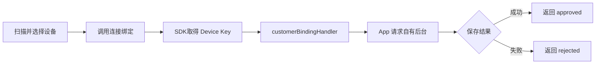

# FindTag iOS SDK 集成说明

## 1. 文档说明

本文为 FindTag iOS SDK 专用集成文档，介绍 XCFramework 集成、蓝牙权限配置及公开 API 的使用方式。

SDK 支持两种业务接入模式：

| 模式 | 适用场景 | 账号、设备关系与列表 |
| --- | --- | --- |
| `TagIntegrationModeOfficial` | 使用 Tag 官方用户体系 | 通过 SDK 完成 |
| `TagIntegrationModeCustomerManaged` | 使用自有用户体系 | 通过 App 和自有后台完成 |

### 1.1 支持环境

- iOS 15.0 及以上。
- Objective-C 或 Swift 工程均可集成，本文示例统一使用 Objective-C。
- 所有异步回调均在主线程执行，可直接更新 UI。

## 2. 添加 SDK

### 2.1 集成 XCFramework

将以下文件加入 App 工程：

```text
sdk-findtag-release.xcframework
```

在 Xcode 中选择 App Target，进入 `General` → `Frameworks, Libraries, and Embedded Content`，添加上述 XCFramework，并将 `Embed` 设置为 `Embed & Sign`。

### 2.2 引入模块

在需要使用 SDK 的 Objective-C 文件中添加：

```objective-c
@import TagSdk;
```

SDK 不依赖第三方网络库，App 无需初始化额外的网络组件。

## 3. 蓝牙权限

### 3.1 Info.plist 配置

在 App 的 `Info.plist` 中添加蓝牙用途说明，文案可根据实际产品调整：

```xml
<key>NSBluetoothAlwaysUsageDescription</key>
<string>用于搜索、绑定和查找您的 Tag 设备</string>
```

也可以在 Target 的 `Info` 页面添加 `Privacy - Bluetooth Always Usage Description`。

### 3.2 授权与蓝牙状态

iOS 会在 App 首次使用蓝牙能力时显示系统授权框。App 无需自行调用独立的蓝牙授权 API，但必须提前配置用途说明。

用户拒绝蓝牙权限时，SDK 返回 `permissionDenied`；蓝牙关闭或当前设备无法使用 BLE 时返回 `bluetoothUnavailable`。

## 4. 初始化与释放

### 4.1 初始化配置

建议在 `AppDelegate` 或业务入口的主线程初始化一次：

```objective-c
TagSdkConfig *config = [[TagSdkConfig alloc]
    initWithIntegrationMode:TagIntegrationModeOfficial
    openApiCredential:nil
    customerBindingTimeoutMs:30000
    customerBindingHandler:nil
    logEnabled:YES];

TagError *initializationError = [TagSdk initializeWithConfig:config];
if (initializationError != nil) {
    [self showError:initializationError];
}
```

`TagSdkConfig` 参数说明：

| 参数 | 类型 | 必填/默认值 | 适用模式 | 说明 |
| --- | --- | --- | --- | --- |
| `integrationMode` | `TagIntegrationMode` | 必填 | 全部 | 1. `TagIntegrationModeOfficial`：使用 Tag 官方账号、设备和定位接口。<br>2. `TagIntegrationModeCustomerManaged`：使用 App 自有用户体系。<br>初始化后不能在运行中切换，需先调用 `releaseSdk` 再重新初始化。 |
| `openApiCredential` | `TagOpenApiCredential *` | 可选；`nil` | 自有用户体系 | 查询定位数据的开放 API 凭证，包含已提供的 `apiKey` 和 `apiSecret`。需要调用 `getDeviceData` 时配置；不查询定位数据可传 `nil`。官方用户体系无需配置。 |
| `customerBindingTimeoutMs` | `int64_t` | 可选；`30000` | 自有用户体系 | SDK 等待 `CustomerBindingHandler` 返回客户后台绑定结果的最长时间，单位毫秒，必须大于 `0`。超时返回 `customerBindingTimeout`。 |
| `customerBindingHandler` | `id<CustomerBindingHandler>` | 可选；`nil` | 自有用户体系 | 由客户自行实现，用于处理自有用户体系的设备绑定。 |
| `logEnabled` | `BOOL` | 可选；`YES` | 全部 | 是否启用 SDK 诊断日志。联调和测试阶段建议保持开启；运行期间也可通过 `setLogEnabled` 切换。 |

`initializeWithConfig:` 成功返回 `nil`，失败返回 `TagError`。

### 4.2 SDK 版本

```objective-c
NSString *version = [TagSdk getSdkVersion];
```

### 4.3 释放

不再使用 SDK 时调用：

```objective-c
[TagSdk releaseSdk];
```

## 5. Tag 官方用户体系接口使用说明

### 5.1 账号接口

#### 5.1.1 注册

```objective-c
TagRegisterRequest *request = [[TagRegisterRequest alloc]
    initWithUsername:username
    password:password];

[TagSdk register:request completion:^(TagAccount *account, TagError *error) {
    if (error != nil) {
        [self showError:error];
        return;
    }

    // 注册成功后仍需显式调用 login。
    [self openLoginPage];
}];
```

注册成功不会自动建立本地登录会话。应引导用户返回登录页并显式调用 `login:completion:`。

#### 5.1.2 登录

```objective-c
TagLoginRequest *request = [[TagLoginRequest alloc]
    initWithUsername:username
    password:password];

[TagSdk login:request completion:^(TagAccount *account, TagError *error) {
    if (error != nil) {
        [self showError:error];
        return;
    }

    [self openHomePage];
}];
```

#### 5.1.3 获取当前账号

```objective-c
TagAccount *account = [TagSdk getCurrentAccount];
```

`TagAccount` 字段：

| 字段 | 说明 |
| --- | --- |
| `accountId` | Tag 账号标识 |
| `username` | 用户名 |
| `nickname` | 可空昵称 |
| `email` | 可空邮箱 |

#### 5.1.4 退出登录

退出账号时调用：

```objective-c
[TagSdk logout];
```

收到 `authenticationFailed` 时，跳转登录页让用户重新登录。

### 5.2 蓝牙状态与设备扫描

#### 5.2.1 监听蓝牙状态

页面实现 `TagBluetoothStateListener`：

```objective-c
@interface DeviceViewController () <TagBluetoothStateListener>
@property (nonatomic, strong) id<TagSubscription> bluetoothSubscription;
@end

@implementation DeviceViewController

- (void)startObservingBluetooth {
    self.bluetoothSubscription = [TagSdk observeBluetoothState:self];
}

- (void)onStateChanged:(TagBluetoothState)state {
    switch (state) {
        case TagBluetoothStatePoweredOn:
            break;
        case TagBluetoothStatePoweredOff:
            [self showBluetoothOff];
            break;
        case TagBluetoothStateUnauthorized:
            [self showBluetoothPermissionHelp];
            break;
        case TagBluetoothStateUnknown:
            break;
    }
}

- (void)stopObservingBluetooth {
    [self.bluetoothSubscription cancel];
    self.bluetoothSubscription = nil;
}

@end
```

订阅成功后会立即回调一次当前状态。页面不再观察时调用 `cancel`。

#### 5.2.2 开始扫描

页面实现 `TagScanListener`：

```objective-c
@interface SearchViewController () <TagScanListener>
@property (nonatomic, strong) id<TagSubscription> scanSubscription;
@end

- (void)startScan {
    TagScanOptions *options = [[TagScanOptions alloc] initWithTimeoutMs:15000];
    self.scanSubscription = [TagSdk startScanWithOptions:options listener:self];
}

- (void)onDeviceFound:(TagDevice *)device {
    // 同一设备后续可能携带更新后的 RSSI，再次回调。
    [self updateDevice:device];
}

- (void)onScanFinished:(TagScanFinishReason)reason {
    [self showScanFinished:reason];
}

- (void)onScanFailed:(TagError *)error {
    [self showError:error];
}
```

`TagDevice` 字段：

| 字段 | 说明 |
| --- | --- |
| `id` | 当前扫描设备标识，可用于列表去重 |
| `name` | 可空广播名称 |
| `rssi` | 最近一次信号强度 |
| `platformAddress` | 广播 MAC 的冒号格式，可能为空 |
| `advertisedMac` | 广播中解析出的可空设备 MAC |

绑定和找设备必须直接使用扫描返回的 `TagDevice`，不要自行构造或持久化。

扫描结束原因：

| 枚举 | 说明 |
| --- | --- |
| `TagScanFinishReasonTimeout` | 到达扫描超时 |
| `TagScanFinishReasonStopped` | 调用了 `stopScan` |
| `TagScanFinishReasonOperationStarted` | 开始绑定或找设备业务，SDK 自动结束扫描 |

扫描失败通过 `onScanFailed:` 返回；重复开始扫描返回 `scanAlreadyRunning`。

#### 5.2.3 停止与取消扫描

```objective-c
[TagSdk stopScan];
```

主动停止会向当前 Listener 回调 `onScanFinished:TagScanFinishReasonStopped`。

```objective-c
[self.scanSubscription cancel];
self.scanSubscription = nil;
```

页面销毁时可调用 `cancel` 停止扫描并取消后续回调。

### 5.3 连接绑定与找设备

绑定和找设备操作按调用顺序串行执行。操作进行中建议禁用重复点击。

#### 5.3.1 连接并绑定

绑定必须使用本次扫描返回的 `TagDevice`：

```objective-c
[TagSdk connectAndBindDevice:selectedDevice
    completion:^(TagBindingInfo *info, TagError *error) {
        if (error != nil) {
            [self showError:error];
            return;
        }

        NSString *deviceKey = info.primaryDeviceKey.deviceKey;
        [self showBindingSuccess:deviceKey];
    }];
```

SDK 会自动完成设备绑定。通过 `info != nil` 或 `error != nil` 判断最终结果。

`TagBindingInfo` 返回本次绑定的主 Device Key：

| 字段 | 说明 |
| --- | --- |
| `primaryDeviceKey` | 主 Device Key |

`TagError` 错误码及处理说明见[第 8 章：错误处理](#8-错误处理)。

#### 5.3.2 找设备

```objective-c
[TagSdk findDevice:selectedDevice
    completion:^(FindDeviceResult *result, TagError *error) {
        if (error != nil) {
            [self showError:error];
            return;
        }

        if (result.triggered) {
            [self showFindDeviceSuccess];
        }
    }];
```

找设备完成后 SDK 自动断开。`battery` 不为空时可读取设备电量。

### 5.4 设备列表、修改、解绑与定位数据

#### 5.4.1 获取设备列表

```objective-c
[TagSdk getDeviceList:^(NSArray<TagDeviceInfo *> *devices, TagError *error) {
    if (error != nil) {
        [self showError:error];
        return;
    }

    [self renderDeviceList:devices];
}];
```

`TagDeviceInfo` 常用字段：

| 字段 | 说明 |
| --- | --- |
| `serverRecordId` | Tag 服务端设备关系记录 ID |
| `tagDeviceId` | 可空的较短设备业务编号；后台有返回时赋值 |
| `deviceName` | 设备名称；首次绑定默认使用蓝牙名称，支持修改 |
| `macAddresses` | MAC 地址 |
| `primaryDeviceKey` | 主 Device Key |
| `batteryLevel` | 可空服务端电量 |
| `deviceType` | 设备类型，可用于关联设备图标，支持修改 |
| `deviceModelRawValue` | 可空设备型号原始值 |
| `supportsElectronicFence` | 是否支持电子围栏 |
| `relationshipType` | 设备关系类型：`1` 为自己绑定的设备，`2` 为分享设备 |

绑定成功后可调用 `getDeviceList:` 刷新设备列表。

#### 5.4.2 修改设备信息

使用设备列表中的主 Device Key 修改设备名称和设备类型：

```objective-c
TagDeviceUpdateRequest *request = [[TagDeviceUpdateRequest alloc]
    initWithDeviceKey:device.primaryDeviceKey
    deviceName:@"我的 Tag"
    deviceType:@"1"];

[TagSdk updateDeviceInfo:request completion:^(NSNumber *success, TagError *error) {
    if (error != nil) {
        [self showError:error];
        return;
    }

    [self refreshDeviceList];
}];
```

`deviceName` 和 `deviceType` 均不能为空。修改成功后可重新调用 `getDeviceList:` 刷新页面。

#### 5.4.3 解绑

直接传入设备列表返回的 `TagDeviceKey`：

```objective-c
[TagSdk unbindDevice:device.primaryDeviceKey
    completion:^(NSNumber *success, TagError *error) {
        if (error != nil) {
            [self showError:error];
            return;
        }

        [self removeDeviceFromUI:device];
    }];
```

解绑时设备无需在附近。

#### 5.4.4 查询定位数据

查询最新数据：

```objective-c
TagDeviceDataQuery *query = [[TagDeviceDataQuery alloc]
    initWithDeviceKey:device.primaryDeviceKey
    preset:TagDeviceDataPresetLatest
    startTimeMs:nil
    endTimeMs:nil];

[TagSdk getDeviceData:query
    completion:^(NSArray<TagDeviceData *> *data, TagError *error) {
        if (error != nil) {
            [self showError:error];
            return;
        }

        TagDeviceData *latest = data.firstObject;
        [self renderLocation:latest];
    }];
```

预设时间范围：

| 枚举 | 说明 |
| --- | --- |
| `TagDeviceDataPresetLatest` | 查询主 Key 及关联从 Key 的最新数据，可能返回多条 |
| `TagDeviceDataPresetLast1Hour`、`TagDeviceDataPresetLast2Hours`、`TagDeviceDataPresetLast4Hours`、`TagDeviceDataPresetLast6Hours` | 最近若干小时 |
| `TagDeviceDataPresetCustom` | 自定义起止时间 |

自定义时间：

```objective-c
TagDeviceDataQuery *query = [[TagDeviceDataQuery alloc]
    initWithDeviceKey:deviceKey
    preset:TagDeviceDataPresetCustom
    startTimeMs:@(startTimeMs)
    endTimeMs:@(endTimeMs)];
```

> [!TIP]
>
> `startTimeMs` 和 `endTimeMs` 使用 Unix 毫秒时间戳。预设查询不能同时携带 `startTimeMs/endTimeMs`；自定义查询必须同时提供有效起止时间且开始时间不能晚于结束时间。

`TagDeviceData` 字段：

| 字段 | 说明 |
| --- | --- |
| `deviceKey` | 本次查询使用的主 Device Key |
| `collectionTimeMs` | UTC Unix 毫秒时间戳 |
| `longitude` / `latitude` | WGS-84 坐标系的经度 / 纬度 |
| `batteryLevel` | 可空电量百分比，范围 `0～100` |
| `accuracyLevel` | 可空定位精度，单位为米（m），数值越小表示定位越精确 |
| `googleLocation` | 定位点类型：`YES` 表示 G 点，`NO` 表示 I 点 |

## 6. 自有用户体系接入

本节适用于 `TagIntegrationModeCustomerManaged`。

### 6.1 使用说明

使用自有用户体系时，双方职责如下：

| 业务能力 | 谁负责 | 说明 |
| --- | --- | --- |
| 账号及用户业务 | App 与自有后台 | 使用现有业务接口 |
| 设备关系与设备资料 | App 与自有后台 | 使用现有业务接口 |
| 绑定（保存用户与设备关系） | App 与自有后台 | 在 `CustomerBindingHandler` 中请求自有后台，保存成功后再回调 `approved` |
| 扫描 / 找设备 | Tag SDK | `startScanWithOptions:listener:`、`findDevice:completion:` |
| 绑定（蓝牙侧） | Tag SDK | `connectAndBindDevice:completion:` |
| 定位数据查询 | Tag SDK | `getDeviceData:completion:`，需在初始化时配置 `openApiCredential` |

绑定流程：



### 6.2 初始化与绑定

> [!TIP]
>
> 调用 `initializeWithConfig:` 时，必须在 `TagSdkConfig` 中设置 `customerBindingHandler`。

实现绑定 Handler：

```objective-c
@interface DemoCustomerBindingHandler : NSObject <CustomerBindingHandler>
@end

@implementation DemoCustomerBindingHandler

- (void)bind:(TagCustomerBindingRequest *)request
    completion:(id<TagCustomerBindingCompletion>)completion {
    NSString *deviceKey = request.bindingInfo.primaryDeviceKey.deviceKey;

    // 使用 App 已有的登录态和网络层，请求自有后台保存用户与 Device Key 的关系。
    [CustomerDeviceService bindDeviceKey:deviceKey completion:^(NSError *error) {
        if (error == nil) {
            [completion complete:[TagCustomerBindingDecision approved]];
            return;
        }

        TagCustomerBindingError *bindingError = [[TagCustomerBindingError alloc]
            initWithMessage:@"绑定失败"
            platformCause:error];
        [completion complete:[TagCustomerBindingDecision rejected:bindingError]];
    }];
}

@end
```

初始化：

```objective-c
DemoCustomerBindingHandler *bindingHandler = [DemoCustomerBindingHandler new];

TagOpenApiCredential *credential = [[TagOpenApiCredential alloc]
    initWithApiKey:providedApiKey
    apiSecret:providedApiSecret];

TagSdkConfig *config = [[TagSdkConfig alloc]
    initWithIntegrationMode:TagIntegrationModeCustomerManaged
    openApiCredential:credential
    customerBindingTimeoutMs:30000
    customerBindingHandler:bindingHandler
    logEnabled:YES];

TagError *initializationError = [TagSdk initializeWithConfig:config];
if (initializationError != nil) {
    [self showError:initializationError];
}
```

### 6.3 保存与恢复 Device Key

绑定时，客户后台必须记录当前用户与完整 `primaryDeviceKey.deviceKey` 的绑定关系。

需要调用 SDK 时直接恢复为 `TagDeviceKey`：

```objective-c
TagDeviceKey *deviceKey = [[TagDeviceKey alloc] initWithDeviceKey:savedDeviceKey];
```

不要修改、截断或拼接 Device Key。

### 6.4 查询定位数据

初始化时配置提供的 `apiKey` 和 `apiSecret`。使用客户后台保存的主 Key 构造 `TagDeviceKey`，然后调用；服务端会通过主 Key 聚合对应附加 Key 的定位数据：

```objective-c
TagDeviceKey *deviceKey = [[TagDeviceKey alloc]
    initWithDeviceKey:customerDevice.savedDeviceKey];

TagDeviceDataQuery *query = [[TagDeviceDataQuery alloc]
    initWithDeviceKey:deviceKey
    preset:TagDeviceDataPresetLatest
    startTimeMs:nil
    endTimeMs:nil];

[TagSdk getDeviceData:query
    completion:^(NSArray<TagDeviceData *> *data, TagError *error) {
        if (error != nil) {
            [self showError:error];
            return;
        }

        [self renderLocation:data.firstObject];
    }];
```

## 7. 日志与问题排查

### 7.1 日志开关

日志默认开启。初始化时关闭：

```objective-c
TagSdkConfig *config = [[TagSdkConfig alloc]
    initWithIntegrationMode:TagIntegrationModeOfficial
    openApiCredential:nil
    customerBindingTimeoutMs:30000
    customerBindingHandler:nil
    logEnabled:NO];
```

运行期间切换：

```objective-c
[TagSdk setLogEnabled:YES];
[TagSdk setLogEnabled:NO];
```

### 7.2 文件日志与导出

文件日志保留 5 天，可通过以下接口导出为 ZIP 文件，并使用系统分享页面发送：

```objective-c
[TagSdk exportLogs:^(TagLogArchive *archive, TagError *error) {
    if (error != nil) {
        [self showError:error];
        return;
    }

    NSURL *fileURL = [NSURL fileURLWithPath:archive.filePath];
    UIActivityViewController *activity = [[UIActivityViewController alloc]
        initWithActivityItems:@[fileURL]
        applicationActivities:nil];
    [self presentViewController:activity animated:YES completion:nil];
}];
```

`TagLogArchive` 提供：

| 字段 | 说明 |
| --- | --- |
| `filePath` | ZIP 文件的绝对路径 |
| `fileSizeBytes` | 文件大小 |
| `createdAtMs` | 创建时间，UTC Unix 毫秒 |

## 8. 错误处理

所有异步错误通过 `TagError` 返回：

| 字段 | 说明 |
| --- | --- |
| `code` | 稳定字符串错误码，业务判断应使用该字段 |
| `message` | 便于诊断的说明，不建议用于业务分支 |
| `serverCode` | 可空服务端业务码 |
| `platformCause` | 可空 `NSError`，仅用于诊断 |

公开错误码：

| 错误码 | 说明 | 错误码 | 说明 |
| --- | --- | --- | --- |
| `notInitialized` | SDK 尚未初始化 | `sdkAlreadyInitialized` | SDK 已经初始化，请勿重复初始化 |
| `invalidArgument` | 参数或配置无效 | `featureNotAvailable` | 当前平台或 SDK 版本不支持该功能 |
| `bluetoothUnavailable` | 设备不支持蓝牙或蓝牙未开启 | `permissionDenied` | App 尚未取得蓝牙权限 |
| `scanAlreadyRunning` | 已有扫描任务正在运行 | `scanFailed` | 蓝牙扫描启动或运行失败 |
| `connectionFailed` | 设备连接失败 | `connectionTimeout` | 连接设备超时 |
| `serviceDiscoveryFailed` | 设备服务发现失败 | `notifyEnableFailed` | 设备通知开启失败 |
| `gattWriteFailed` | 数据发送失败 | `commandTimeout` | 等待设备响应超时 |
| `disconnected` | 操作过程中设备意外断开 | `sdkReleased` | SDK 释放导致当前操作结束 |
| `frameFormatError` | 设备返回的数据格式错误 | `payloadTooLarge` | 设备返回的数据长度超出限制 |
| `checksumError` | 设备返回的数据校验失败 | `responseMismatch` | 设备响应与当前操作不匹配 |
| `unknownResponse` | 收到无法识别的设备响应 | `deviceRejected` | 设备拒绝当前操作 |
| `keyMissing` | 未能从设备取得 Device Key | `bindingUnsupported` | 当前设备不支持绑定 |
| `alreadyBound` | 当前账号已绑定该设备 |  |  |
| `customerManagedOperation` | 当前接口应由自有用户体系处理 | `customerBindingHandlerMissing` | 未配置自有用户体系绑定处理器 |
| `customerBindingRejected` | 自有用户体系拒绝绑定 | `customerBindingTimeout` | 等待自有用户体系处理绑定超时 |
| `openApiCredentialMissing` | 开放 API 凭证未配置或无效 | `openApiDeviceKeyUnsupported` | 当前 Device Key 暂不支持开放 API |
| `networkError` | 网络请求失败 | `authenticationFailed` | 登录状态失效或鉴权失败 |
| `serverError` | 服务端拒绝或返回异常数据 | `logExportFailed` | 日志导出失败 |

官方用户体系重复绑定当前账号已经拥有的设备时，SDK 会核对设备列表；列表中存在相同 `primaryDeviceKey` 时直接断开设备并返回 `alreadyBound`，不再向设备发送绑定结果指令。其他服务端拒绝统一返回 `serverError`，具体提示使用 `message`，`serverCode` 仅用于问题排查。

自有用户体系应在 `CustomerBindingHandler` 中自行判断重复绑定；同一用户与同一 Device Key 已存在绑定关系时，建议直接返回 `approved`。

建议统一处理：

```objective-c
- (void)handleSdkError:(TagError *)error {
    if ([error.code isEqualToString:[TagErrorCode permissionDenied]]) {
        [self showBluetoothPermissionHelp];
    } else if ([error.code isEqualToString:[TagErrorCode bluetoothUnavailable]]) {
        [self showEnableBluetoothGuide];
    } else if ([error.code isEqualToString:[TagErrorCode alreadyBound]]) {
        [self showAlreadyBound];
    } else if ([error.code isEqualToString:[TagErrorCode authenticationFailed]]) {
        [self openLoginPage];
    } else {
        [self showError:error];
    }
}
```

业务判断使用 `error.code`。

## 9. SDK 修订记录

**V1_0828** (2026.08.28)

- Tag 基础功能
